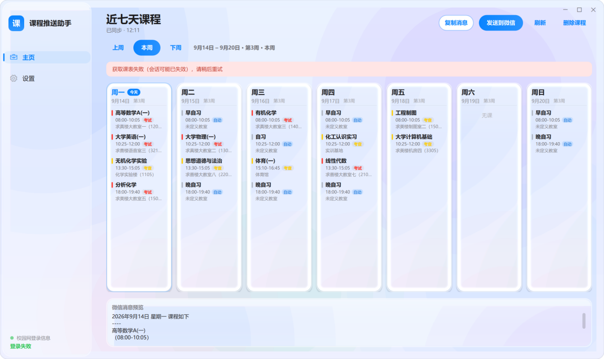
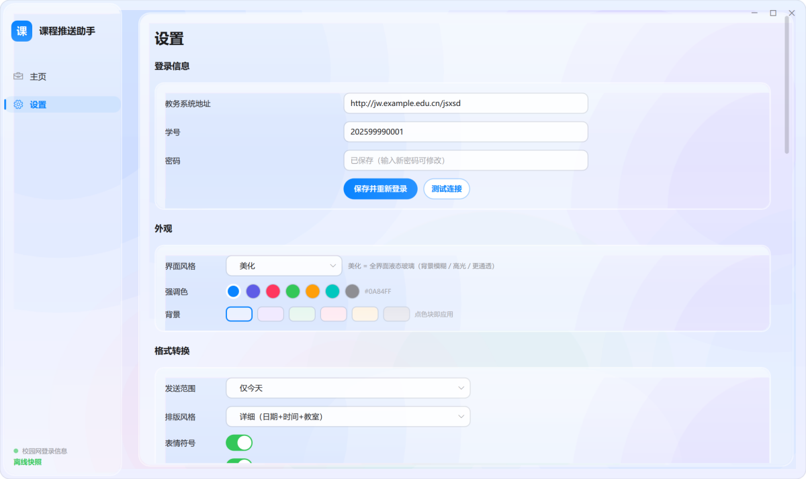

# 课程推送助手 (Course Pusher)

一款 Windows 桌面小工具：**自动登录学校教务系统 → 抓取课表 → 排版 → 通过微信自动发送**，
主页以「近七天课程」卡片呈现，界面为 Apple 风格（可选液态玻璃）。

> 目前适配的是**强智科技教务系统**（路径形如 `/jsxsd/`）。其它教务系统需要改 `app/school.py` 里的抓取逻辑。



## 目录

- [功能特性](#功能特性)
- [界面截图](#界面截图)
- [环境要求](#环境要求)
- [安装](#安装)
- [快速开始](#快速开始)
- [功能详解](#功能详解)
- [消息格式](#消息格式)
- [自习自动补全规则](#自习自动补全规则)
- [课表文件导入](#课表文件导入)
- [微信发送是怎么实现的](#微信发送是怎么实现的)
- [界面与风格](#界面与风格)
- [打包成 exe](#打包成-exe)
- [常见问题](#常见问题)
- [项目结构](#项目结构)
- [开发与自检工具](#开发与自检工具)
- [免责声明](#免责声明)
- [许可证](#许可证)

## 功能特性

| 模块 | 说明 |
|---|---|
| 自动登录 | 首次在设置里填入学号密码并保存（用 **Windows DPAPI 加密**存本机，不写进代码、不落明文），之后每次启动自动登录 |
| 课表抓取 | 抓取**整学期**课表与当前周次；抓取失败自动退避重试（1.2s / 2.5s / 4s），会话失效自动重新登录 |
| 近七天主页 | 七天课程**横向平铺一行**，今天高亮；每天课程严格按上课时间先后排序 |
| 前后周查看 | 「上周 / 本周 / 下周」切换查看其它周的课表（整学期数据在本地换算，不重新请求）；标题随之变为「第 N 周课程」 |
| 课程类型标注 | 从教务系统读取「考核方式」并结合课程名/学时判定：**考试=红、考查=黄、实训=绿**，其它为中性灰 |
| 课程详情 | 课程上**点右键**查看：课程名称 / 授课老师 / 授课地点 / 授课时间 / 课程类型 / 总课程节数 / 当天第几门 |
| 右键加课 | 课表卡片区**点右键**直接添加课程（名称、老师、星期、节次、地点） |
| 拖动调课 | 按住课程**上下拖动到另一门课上** → 两门课互换时间，时间自动更新 |
| 删除课程 | 主页右上角「删除课程」进入删除模式，逐门删除（带果冻动画）；教务系统课程按当天隐藏，临时课程永久删除 |
| 临时课程 | 可添加教务系统里没有的课程（自习、临时调课等），指定星期 / 时间 / 教室 / 周次 |
| 手动描述解析 | 设置里可直接输入「周二 一二节 3614」，自动识别星期、节次/时间、教室、课程名 |
| 文件导入 | 导入学校的 Excel(.xlsx) / Word(.docx) 自习或调课安排，自动识别本班那一行，把教室填进课表 |
| 自动补自习 | 早自习 / 第 3-4 节自习 / 晚自习按规则自动补全，详见[规则表](#自习自动补全规则) |
| 定时发送 | 指定每天某个时间自动刷新课表并发送到微信（每天一次） |
| 开机自启 | 一键写入注册表开机自启 |
| 系统托盘 | 关闭窗口最小化到托盘，定时发送持续运行；重复启动会自动唤出已有窗口（单实例保护） |
| 教室楼名 | 只写四位数字的教室统一写成括号形式（`3614` → `（3614）`），并可配置首位数字对应的楼名（见「可配置项」） |
| 界面风格 | 「正常 / 美化」两套风格；美化 = 全界面液态玻璃（真背景模糊 + 边缘折射着色器） |
| 配色自定义 | 强调色 7 种预设 + 背景渐变 6 种预设，点一下立即全局生效 |
| 课名精简 | 体育类课程自动去掉运动项目名，如 `体育健康教育(三)(排球)` → `体育健康教育(三)` |

## 界面截图

主页（美化风格）：


设置页：



> 截图使用虚构的演示课表，不含任何真实数据。

## 环境要求

- **Windows 10 / 11**
- **Python 3.10+**（开发运行）
- **微信 PC 版**已登录（用于发送消息）
- 能访问学校教务系统

## 安装

```bash
# 1. 获取代码
git clone https://github.com/<你的用户名>/course-pusher.git
cd course-pusher

# 2. 安装依赖（国内可用镜像加速）
pip install -r requirements.txt
# 或： pip install -i https://mirrors.aliyun.com/pypi/simple/ -r requirements.txt
```

依赖清单（`requirements.txt`）：

| 包 | 用途 |
|---|---|
| PySide6 | 界面（Qt 6 / QML） |
| requests | 访问教务系统 |
| beautifulsoup4 | 解析课表 HTML |
| openpyxl | 读 Excel 课表文件 |
| python-docx | 读 Word 课表文件 |
| chinesecalendar | 判断法定节假日与调休（用于自习规则） |

## 快速开始

### 1. 启动

```bash
python main.py
```

### 2. 首次配置

1. 左侧点「**设置**」→「**登录信息**」，先填**教务系统地址**（形如 `http://jw.example.edu.cn/jsxsd`），
   再填**学号**与**密码**，点「**保存并重新登录**」。
   - 密码会用 Windows DPAPI 加密后保存在 `%APPDATA%\CoursePusher\config.json`，**与本机用户绑定，换台电脑无法解密**。
   - 也可以先点「测试连接」验证账号密码是否正确。
2. 登录成功后回到「主页」，七天课程会自动显示。

### 3. 配置微信发送

1. 「设置」→「**运行方式**」：
   - **发送目标**：填微信群名或联系人（建议先用 `文件传输助手` 测试）
   - **发送方式**：`手动发送` 或 `指定时间自动发送`（选自动时填时分）
3. 点「**发送测试消息**」验证：软件会自动打开微信 → 搜索目标 → 粘贴 → 发送。
   - ⚠️ **发送那几秒请不要操作键盘鼠标**（软件在模拟按键）。

### 4. 日常使用

- 想立刻发一次：主页右上角「**发送到微信**」
- 只想复制文字：主页右上角「**复制消息**」，或设置页的预览框「复制」
- 关闭窗口 = 最小化到托盘，定时发送继续工作；托盘图标双击可唤回窗口

## 功能详解

### 主页

- **七天卡片**：一行平铺，今天有蓝色描边；每张卡片显示该天的课程（名称、时间、教室）。
- **周次切换**：「上周 / 本周 / 下周」，右侧显示日期区间与周次，如 `9月15日 – 9月21日 · 第3周`。
- **课程右键**：查看该课程的详细信息（含"总课程节数/当天第几门"）。
- **空白处右键**：直接添加课程。
- **拖动课程**：按住某门课上下拖到另一门课上，两者时间互换。
- **删除课程**：点「删除课程」后，每门课右上角出现 ✕；教务系统课程按当天隐藏（刷新后仍隐藏），临时课程与自习永久删除。
- **消息预览**：底部实时显示"将要发送的微信内容"。

### 设置 · 登录信息

- **教务系统地址**：形如 `http://jw.example.edu.cn/jsxsd`（各校不同，第一次使用必须填；不写死在校验码里）
- **学号 / 密码**：保存后加密存储，可随时修改
- **测试连接**：验证账号密码是否正确

### 设置 · 登录信息之外的可配置项

少数和学校/校区相关的数据放在配置里，不写死在代码里（配置文件：`%APPDATA%\CoursePusher\config.json`）：

| 配置项 | 说明 |
|---|---|
| `school_base` | 教务系统地址（等价于设置里的输入框） |
| `room_buildings` | 教室首位数字 → 楼名，例如 `{"1": "求真楼", "2": "求善楼", "3": "求美楼"}`；留空则不补楼名 |
| `period_times` | 节次 → 上课时间映射（等价于设置里的「节次时间」） |

### 设置 · 外观


- **界面风格**：`正常`（素雅白面）/ `美化`（液态玻璃：真背景模糊 + 边缘折射 + 跟随鼠标的高光）
- **强调色**：7 个预设色块，点一下全局生效（按钮、选中态、描边、今日高亮都跟着变）
- **背景**：6 种渐变预设（晨雾 / 薄紫 / 薄荷 / 樱花 / 暖沙 / 石墨）

### 设置 · 格式转换

- **发送范围**：仅今天 / 近七天
- **排版风格**：详细 / 紧凑
- **表情符号**：开关
- **节次时间**：五档「节次 → 上课时间」映射，详细风格按它换算时间（默认 08:00-10:05 / 10:25-12:00 / 13:30-15:05 / 15:10-16:45 / 18:00-19:40，如与学校不同请改）
- **发送信息预览**：实时预览将要发送的文本

### 设置 · 课表文件导入

学校常会发 Excel/Word 的「早自习教室安排」「晚自习安排」「临时调课」等文件，这里可以直接吃进去：

1. 「**我的班级**」：留空时用教务系统自动识别到的班级；也可以手动填
2. 点「**选择文件导入**」，选中 `.xlsx` / `.docx`
3. 软件会自动：识别表头（星期 / 一二节·三四节…）→ 展开合并单元格 → 找到本班那一行 → 把对应星期、节次的教室填进课表
4. 文件名里含「第N周」时自动识别适用周次（所以第 2 周的文件不会串到第 3 周）
5. 已导入的文件列在下方，可随时「移除」

也支持**手动描述**：直接粘贴/输入，

```
周二 一二节 3614
周三 3-4节 高等数学 求真楼1117
周四晚自习 18:00-19:40 3614
周五 13:30-15:05 大教室十（2415） 化工原理
```

会自动识别星期、节次或具体时间、教室、课程名，然后「解析并应用」。

### 设置 · 临时课程

教务系统里没有、但需要一起推送的课程（如自习、临时调课）：填名称 / 星期 / 时间 / 教室 / 周次（留空=每周）。
主页卡片上会带橙色「临时」标记。

### 设置 · 运行方式

- **发送方式**：手动 / 指定时间
- **发送时间**：时分
- **发送目标**：微信群名或联系人
- **微信路径**：留空自动检测 `WeChat.exe`；如果微信装在非常规位置可手动填
- **开机自启动**：写入注册表 `HKCU\...\Run`

## 消息格式

「详细」风格严格按下面格式输出（分隔线是四个短横线，时间用全角括号）：

```
2025年11月19日 星期三 课程如下
----
自习
（08:30-10:05）
求真楼（1117）
----
外语
（10:25-12:00）
求真楼-求真楼（1117）
----
基础化学
（13:30-15:05）
未定义教室
----
高等数学
（15:10-16:45）
求善楼大教室一（2401）
```

- 时间是**实际时钟时间**，由「节次」按设置里的映射表换算
- 教室为「教学楼 + 教室」；教务系统未填写的占位值（如「未定义教学楼」）会被忽略，缺失时显示「未定义教室」
- 选「近七天」时，每天输出一个上述区块，区块之间空行分隔
- 「紧凑」风格则是一门课一行

## 自习自动补全规则

判定顺序：**用户文件 / 描述 > 内置规则**（文件里写了就一律按文件，冲突也以文件为准）。

| 情况 | 早自习(1-2节) | 自习(3-4节) | 晚自习(9-10节) |
|---|---|---|---|
| 有课 · 1-2节空、3-4节有课 | ✅ 08:00-10:05 | — | ✅ 18:00-19:40 |
| 有课 · 1-2节有课、3-4节空 | — | ✅ 10:25-12:00 | ✅ |
| 有课 · 上午两节都空 / 都满 | — | — | ✅ |
| 满课（五个大节全满） | — | — | — |
| 没课 · 周一~周四（正常上课日） | — | — | ✅ |
| 没课 · 周一~周五（法定放假） | — | — | — |
| 没课 · **周五** | — | — | —（周五取消晚自习） |
| 没课 · 周六（非串休） | — | — | — |
| 没课 · 周六（串休） | ✅ | — | — |
| 没课 · 周日（非串休） | — | — | ✅ |
| 没课 · 周日（串休） | ✅ | — | ✅ |

补充说明：

- 晚自习永远只在第 9-10 节空着时才加；那天本来有课就不加、也不覆盖
- 教室优先取用户文件里的教室（`3614` → `求美楼（3614）`）
- **串休**判定（逐天）：① 用户文件在这一天安排了自习 ② 国家法定调休（`chinesecalendar`）
- **法定放假**判定使用 `chinesecalendar`；未安装时周末一律按双休处理

## 课表文件导入

见[设置 · 课表文件导入](#设置--课表文件导入)。识别的表格形态：

```
行1:  周一        | 周二        | 周三        | ...
行2:  一二节 三四节 | 一二节 三四节 | 一二节 三四节 | ...
行3:  化工2531     | 3506 | /    | /    | /     | ...
行4:  应化2501     | /    | 3511 | /    | 3511  | ...
```

格子填教室、`/` 或留空表示没有安排。若表头没有节次行，会按文件名/内容推断是早自习还是晚自习。

## 微信发送是怎么实现的

**不注入、不修改协议**，用的是 Windows 原生界面自动化：

1. 找到微信主窗口（兼容 3.x `WeChatMainWndForPC` 与 4.x `mmui::MainWindow`），没运行就启动它
2. 把窗口切到前台 → `Ctrl+F` 打开搜索 → 输入群名/联系人 → 回车进入会话
3. 把消息写入剪贴板 → `Ctrl+V` 粘贴 → 回车发送

要求电脑上微信已登录。发送那几秒不要操作键鼠。

> 如果你更希望用官方接口，可改用 Server酱 / 企业微信群机器人等 webhook，只需替换 `app/wechat.py` 里的发送实现。

## 界面与风格

- 窗口为**无边框圆角**，可拖动标题栏移动、可拖拽八条边/四角改变大小，退出后记住尺寸与位置
- 「美化」风格的玻璃是**真的背景模糊 + 边缘折射**，由 `app/ui/shaders/liquidglass.frag` 实现：
  解析求出圆角矩形的 SDF，取其梯度作为边缘法线，按「法线 × 边缘距离 × 厚度」偏移背景采样坐标，
  并带轻微色散——与网页版液态玻璃（`liquid-glass-react` 那一类）的位移图思路一致，
  区别是这里直接解析求得位移场，不需要预先生成位移图。
- Qt 6 的 ShaderEffect **必须加载 qsb 预编译着色器**（内联 GLSL 会被当成文件路径）。仓库里已包含编译好的
  `liquidglass.frag.qsb`，**运行不需要 qsb**；只有修改着色器时才需要重新编译：

  ```bash
  # qsb 可从 PySide6-Addons 的 wheel 中取出（PySide6/qsb.exe）
  qsb --glsl "100 es,120,310 es" --hlsl 50 --msl 12 \
      -o app/ui/shaders/liquidglass.frag.qsb app/ui/shaders/liquidglass.frag
  ```

## 打包成 exe

```bash
pip install pyinstaller
pyinstaller --noconsole --name CoursePusher --add-data "app/ui;app/ui" --icon assets/app.ico main.py
```

生成的 `dist/CoursePusher/CoursePusher.exe` 可直接拷到别的电脑用。

- `--add-data "app/ui;app/ui"` **必须带上**（QML、着色器 `.qsb`、图标都在里面）
- 打包后建议再做一次快捷方式：

  ```bash
  python tools/create_shortcut.py     # 在桌面创建带图标的快捷方式（用 pythonw 启动，无控制台窗口）
  ```

## 常见问题

**Q：登录提示"教务系统没有建立会话"？**
短时间反复登录可能被教务系统限流。客户端已内置退避重试（1.2s / 2.5s / 4s）并会自动重登；
若持续失败，等几分钟再试，并确认学号密码正确。

**Q：抓不到课表 / 课程是空的？**
先点主页「刷新」。若仍为空，检查是否能正常打开教务系统网页；学校维护或限流时会暂时取不到。
排查时可以在日志里看原因：`%APPDATA%\CoursePusher\app.log`。

**Q：提示"未找到微信程序"？**
在「设置 → 运行方式 → 微信路径」里填 `WeChat.exe` 的完整路径（微信 4.x 通常叫 `Weixin.exe`）。

**Q：定时发送没触发？**
① 确认「发送方式」选了"指定时间自动发送"；② 软件需要在运行（可最小化到托盘）；
③ 当天已经发送过一次就不会重复发送；④ 确认"发送目标"填的是真实存在的群/联系人。

**Q：每次启动都提示要配置？**
配置保存在 `%APPDATA%\CoursePusher\config.json`。如果这个目录被清理或换了 Windows 账号，
DPAPI 解不开原密码，需要重新填写一次。

**Q：界面字体/大小看着不对？**
程序未内置字体，使用系统「微软雅黑 UI」。高 DPI 缩放下 Qt 会自动适配。

**Q：双击桌面图标没反应？**
用「设置 → 运行方式」确认程序在运行（可能在托盘）；日志见 `%APPDATA%\CoursePusher\app.log`。
重复双击不会开第二个实例，而是唤出已有窗口。

## 项目结构

```
main.py                    入口（QML 引擎装配、单实例保护、调试参数）
app/
  school.py                强智教务系统客户端：登录 / 课表解析 / 当前周 / 教室楼名 / 考核类型
  formatting.py            消息排版（今天·近七天 × 详细·紧凑）
  importer.py              Excel / Word / 手动描述的解析
  wechat.py                微信桌面版自动化发送
  config.py                配置持久化 + DPAPI 密码加密 + 开机自启
  bridge.py                QML 后端：线程化任务、定时器、托盘、周次切换、删除/移动课程
  ui/
    Main.qml               无边框圆角主窗口（拖动 / 八向缩放 / 页面切换 / 托盘提示）
    HomePage.qml           近七天卡片 + 周次导航 + 课程详情/加课弹窗
    SettingsPage.qml       登录信息 / 外观 / 格式转换 / 课表文件导入 / 临时课程 / 运行方式
    AuroraBg.qml           渐变动态背景
    shaders/liquidglass.frag(.qsb)   液态玻璃折射着色器（源码 + 编译产物）
    widgets/               按钮、开关、卡片、滚动面板、输入框、日卡片、玻璃面板等
assets/app.ico             图标
tools/                     开发与自检脚本（见下）
docs/                      截图
```

## 开发与自检工具

`tools/` 下都是独立脚本，正式使用不需要：

```bash
python tools/create_shortcut.py                 # 生成图标 + 创建桌面快捷方式
python tools/dump_schedule.py                   # 把抓到的课表导出成 JSON 快照（离线调试用）
python main.py --offline 快照.json               # 用快照离线启动，不访问教务系统
python main.py --page 1                         # 直接打开设置页
python main.py --deletemode                     # 启动即进入"删除课程"模式
python main.py --import 文件.xlsx                # 启动后自动导入该文件
python main.py --import-text "周二 一二节 3614"   # 启动后按手动描述解析
python main.py --shot out.png --delay 5000      # 由 Qt 直接导出窗口渲染结果（不受遮挡影响）
python tools/capture.py shot.png                # 截取窗口（正确处理高 DPI 与遮挡）
python tools/stop_app.py                        # 停止所有实例并清掉单实例锁
python tools/test_resize.py                     # 自动拖拽窗口四边/四角，校验缩放
python tools/test_scrollbar.py vertical         # 拖动滚动条，校验是否 1:1 跟手
python tools/ui_click.py X Y                    # 置前窗口并模拟点击（屏幕物理坐标）
```

> `tools/ui_click.py` 用合成鼠标事件驱动界面。若上一次运行异常退出，系统可能残留
> "左键处于按下"的状态，之后鼠标移到按钮上会被 Qt 当成一次点击（幽灵点击）。
> 脚本已在点击前后补发抬起事件；如仍遇到怪异行为，先手动点一下鼠标左键释放。

## 免责声明

- 本项目仅供**个人学习与课程提醒**使用，请遵守所在学校教务系统的使用规定，**不要高频请求**。
- 微信发送依赖本机已登录的微信客户端，通过模拟键鼠操作实现，请自行评估使用风险。
- 账号密码仅保存在本机（Windows DPAPI 加密），不会上传到任何服务器。

## 许可证

[MIT](LICENSE)
